---
aliases:
- "CSAW 2026 Qualifier: The Vantage Job"
- "CSAW 2026 Qualifier: The Vantage Job"
---

> \[!The Vantage Job\]
> "Three nights ago, Solenne & Vane, a private auction house in Geneva, was robbed of a hardware wallet holding the keys to a dormant 340 BTC wallet, once seized in a fraud case and quietly re-listed for a closed-bid sale. No forced entry. No alarms. Interpol's cybercrime liaison is out of leads through official channels, which is why you've been brought in.
>
> One thing is certain: the person behind this can't resist bragging.
>
> The thief goes by **"Ferryman."**
>
> Attached is a file left by the thief on the company's server and a poem he left along with it."

### Overview:

In this challenge, you are given two files and a name. a seemingly empty PDF file called "evidence_01.pdf" and a text file with a short poem called "evidence_02.txt". these files will lead you down a rabbit hole of riddle after riddle, testing your patience and logical deduction

### The Evidence:

When I first got these files, the first thing I did, like most would, was open them. inside the PDF was seemingly nothing. but inside the TXT was a poem. it read:

> "Paper keeps what paper hides,
> pale as breath on frosted glass.
> Not empty only patient,
> waiting for the light to pass."

The things that immediately stood out to me were the lines: "Not empty only patient" and "waiting for the light to pass". this immediately pointed to the PDF file containing hidden white-on-white text. At first I attempted to use highlighting to find hidden text, but this failed.

My next idea was to put the PDF file into a my preferred online PDF analysis tool, https://pdfcrowd.com/inspect-pdf/. This revealed exactly why I couldn't highlight the text, it was embedded in an image!

I then used pdfimages on the file, and sure enough, there was a plain white image embedded in it.

<figure>
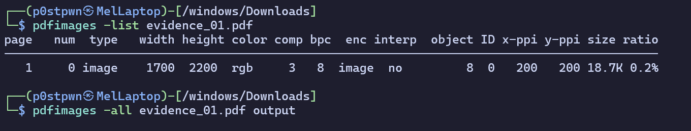
<figcaption
aria-hidden="true">Pastedimage20260919143039.png</figcaption>
</figure>

Now that I had the image extracted, I was able to put it into CyberChef to extract the bitmap, revealing any slightly off-colour sections. And, there it was: the next clue in the puzzle.

<figure>
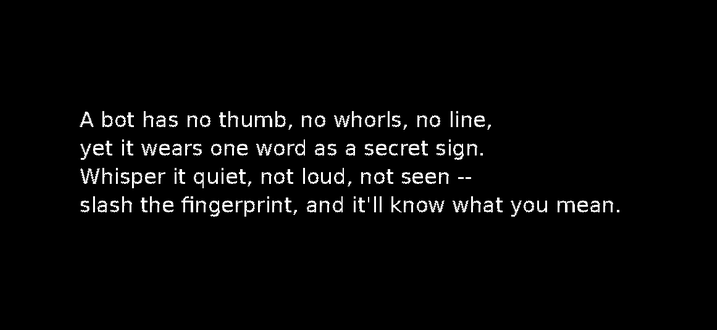
<figcaption
aria-hidden="true">Pastedimage20260919143316.png</figcaption>
</figure>

> "A bot has no thumb, no whorls, no line.
> yet it wears one word as a secret sign
> whisper it quiet, not loud, not seen--
> slash the fingerprint, and it'll know what you mean."

### The Fingerprint:

I would be lying if I said this next riddle didn't throw me for a loop.
I attempted everything from searching the PDF file for a hidden "Fingerprint" string, to trying to find a /fingerprint page on the CSAW website!

to begin, we can immediately extract some important information from this poem:

**"A bot has no thumb, no whorls, no line"**
- A bot? perhaps we are dealing with some sort of automated system?

**"yet it wears one word as a secret sign"**
\* perhaps there is some sort of secret message we can send the bot to get it to respond?

**"whisper it quiet, not loud, not seen--"**
\* perhaps whatever we need to send to this bot needs to be private? encrypted maybe? or perhaps a direct message?

**"slash the fingerprint, and it'll know what you mean"**
\* when I first heard this my mind immediately went to a sha256 sum, but perhaps it could literally mean /fingerprint?

So this raises the question, what kind of thing:
\* is a bot
\* can be sent a secret activation code
\* can be directly contacted/messaged
\* can be communicated with using a slash prefix

what about.. **A DISCORD BOT?**

But how could I find this Discord bot? well, looking back at the initial prompt for the CTF, it mentioned the hackers name is "*Ferryman*". so perhaps there is a Discord bot somewhere named *Ferryman* that I can message? so I checked the official CSAW 2026 CTF discord server, and lo and behold, there it was, hidden deep in the user list, an account with the APP tag named Ferryman!

<figure>
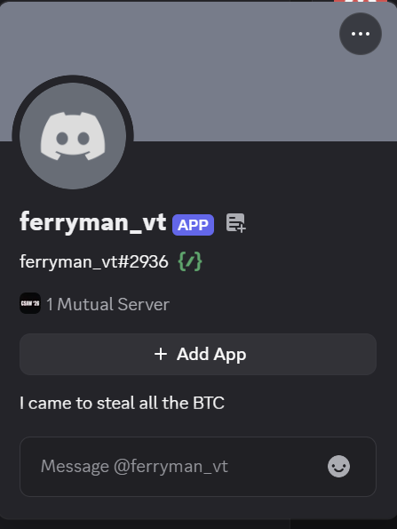
<figcaption
aria-hidden="true">Pastedimage20260919144834.png</figcaption>
</figure>

So, I decided to DM the bot the command: "/fingerprint" and it responded!

<figure>
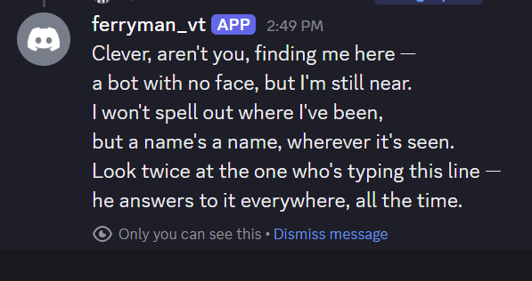
<figcaption
aria-hidden="true">Pastedimage20260919144942.png</figcaption>
</figure>

> "Clever, aren't you, finding me here --
> a bot with no face, but I'm still near.
> I won't spell out where I've been,
> but a name's a name, wherever it's seen.
> Look twice at the one who's typing this line --
> he answers to it everywhere, all the time."

### The Name:

In this riddle, one section stood out to me:

**"a name's a name, wherever it's seen.
****Look twice at the one who's typing this line --
****he answers to it everywhere, all the time"**

> "Look at the one who's typing this"
> "he answers to it everywhere, all the time"

Sounds like what we are looking for is another account somewhere out there with the same name as the bot, "ferryman_vt". its OSINT, my favorite!

So, the first thing I did was...Check the CTF player list!... no dice! then the team list...nothing. so what's the next step? well, doxxing of course! lets cyber-stalk Mr. ferryman! and to do this, I will be using a website called: https://instantusername.com/. I originally tried to use the command line tool "Sherlock", but It turned up empty. so lets put ferryman_vt into the site!

<figure>
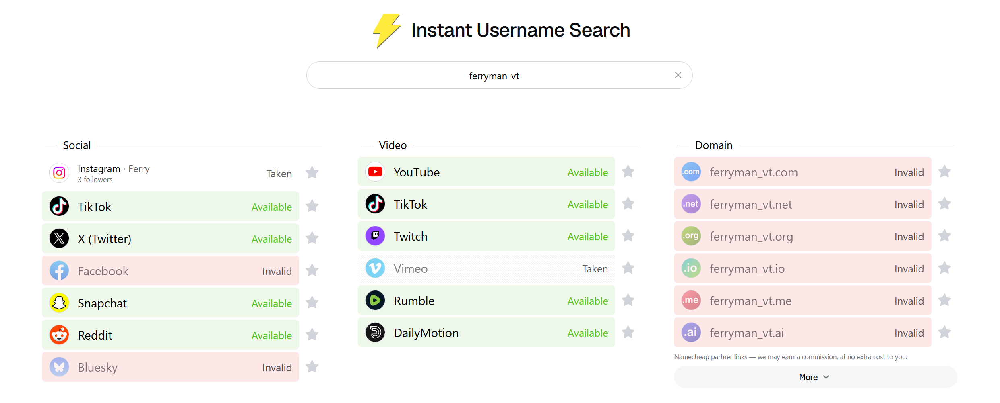
<figcaption
aria-hidden="true">Pastedimage20260919145934.png</figcaption>
</figure>

> \[!NOTE\]
> This is where the way *I* solved the CTF, and the *Intended* way to solve it diverge. so I will first show the intended way proceed, and at the end show you how *I* solved it.

### Instagram:

#### The Intended Path:

we got two matches! Vimeo, and Instagram. Vimeo turned out to be a false-positive, but the Instagram was real! and it was created the day before the CTF opened!

there was one single post on the Instagram account:

<figure>
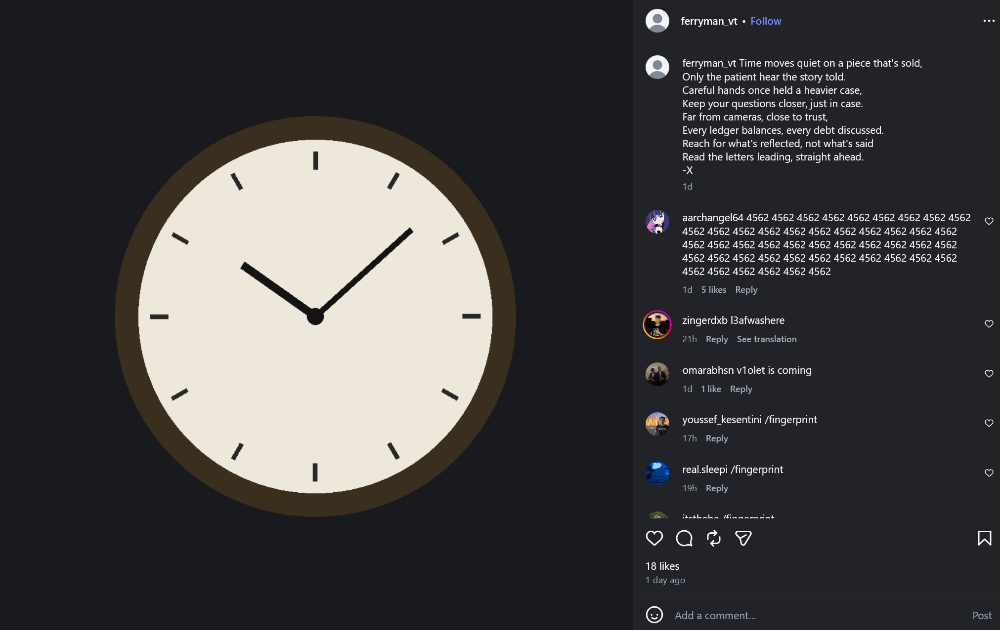
<figcaption
aria-hidden="true">Pastedimage20260919150505.png</figcaption>
</figure>

> "Time moves quiet on a piece that's sold,
> Only the patient hear the story told
> Careful hands once held a heavier case
> keep your questions closer, just in case.
> Far from cameras, close to trust.
> Every ledger balances, every debt discussed
> Reach for what's reflected, not what's said
> Read the letters leading, straight ahead.
> -X"

The smoking gun for solving this riddle was relatively simple, the final line tells you exactly what to do: "**Read the letters leading, straight ahead.**" to me, this sounds like its telling us to read the first letter (leading letter) of every line (straight ahead). so lets do that!

1.  (T)ime moves quiet on a piece that's sold,
2.  (O)only the patient hear the story told
3.  (C)areful hands once held a heavier case,
4.  (K)eep your questions closer, just in case.
5.  (F)ar from cameras, close to trust.
6.  (E)very ledger balances, every debt discussed
7.  (R)each for what's reflected, not what's said
8.  (R)ead the letters leading, straight ahead

"T.O.C.K.F.E.R.R"

given the presence of a clock image in the post (Tock) and the name of the account (**FERR**yman). it seems that this could be an alternate username for our culprit? but what could it be for?

well, the answer to that is closer than it seems!. this post is signed "-X". this does not match any known alias for the hacker, nor has it been done for any other section of this CTF. so perhaps it is not referring to the author, but to the app the username leads to?

### The Path I Took:

now, in all my sleep deprived 3am genius, I somehow managed to COMPLETELY MISS the Instagram account on my first solve. so Instead, I took a different route:

when all I could find was a v-tuber's socials, I decided to go on every social media I could think of, and one by one search the name "ferryman_vt". Eventually, I managed to brute-force my way to this twitter account:
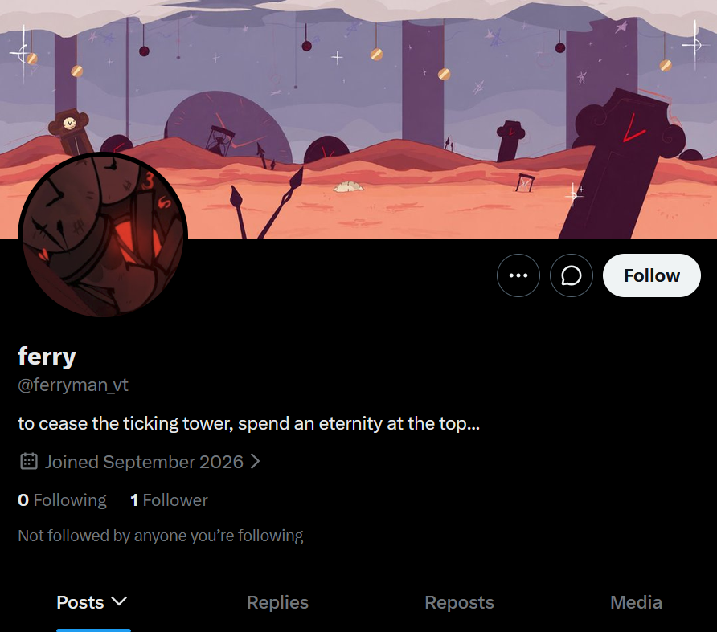

I was really confused by this, and frankly I still am. why does it have a completely unique PFP and banner? but regardless. all that I could find, was its one, lone follower:

<figure>
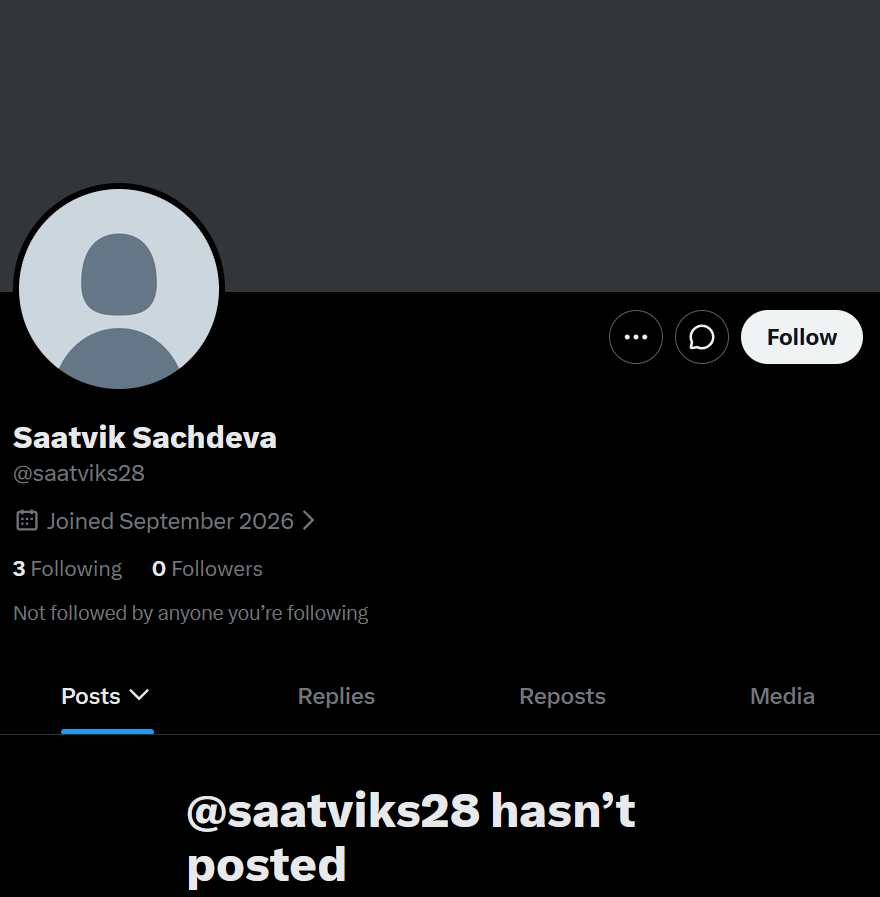
<figcaption
aria-hidden="true">Pastedimage20260919153226.png</figcaption>
</figure>

Now to be completely frank with you, I'm fairly sure this account is not part of the CTF, and is instead just another player. but, this account did have one interesting followed account:

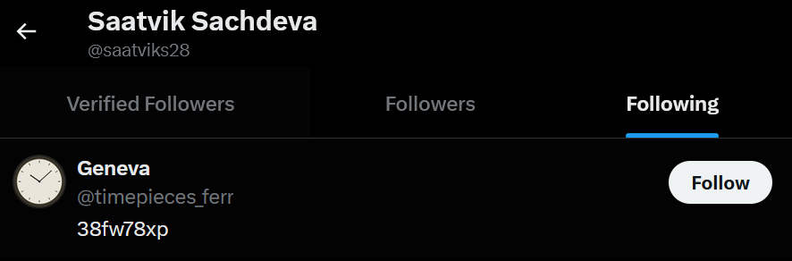
\#### Twitter (Still Not Calling It X)

sadly, the biggest loss of this entire CTF came to me in this stage...I was forced to make a twitter account :( But fear not! for it was worth it!

if we search for an "@tockferr" on twitter, we get an account that was made the same day as the Instagram!

<figure>
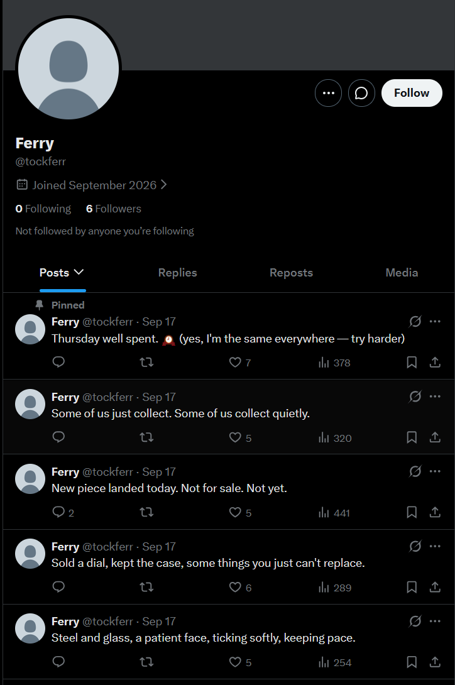
<figcaption
aria-hidden="true">Pastedimage20260919151651.png</figcaption>
</figure>

**"Thursday well spent 🕰️ (yes, I'm the same everywhere -- try harder)"**

**"Some of us just collect. Some of us collect quietly."**

**"New piece landed today. Not for sale. Not yet."**

**"Sold a dial, kept the case, some things you just can't replace."**

**"Steel and glass, a patient face, ticking softly, keeping pace."**

before I began investigating the Tweets themselves, I noticed something else. one of these posts has a couple of comments. the first one was just a fellow player, but the second one caught my eye. the profile picture of the commenter was the same clock that was in the Instagram post, and its name was "*Geneva*", the same city that the bitcoin was stolen in!

<figure>
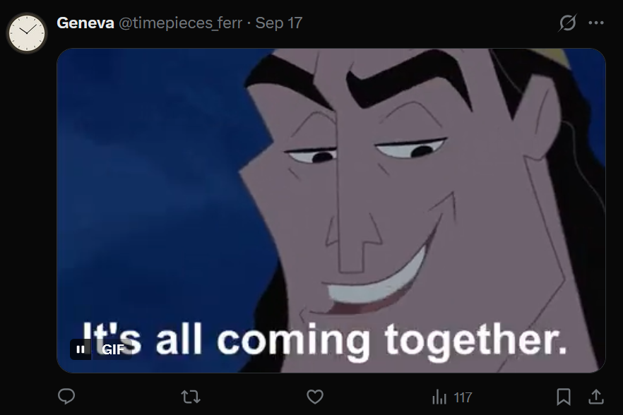
<figcaption
aria-hidden="true">Pastedimage20260919152225.png</figcaption>
</figure>

On the account was a single post:

<figure>
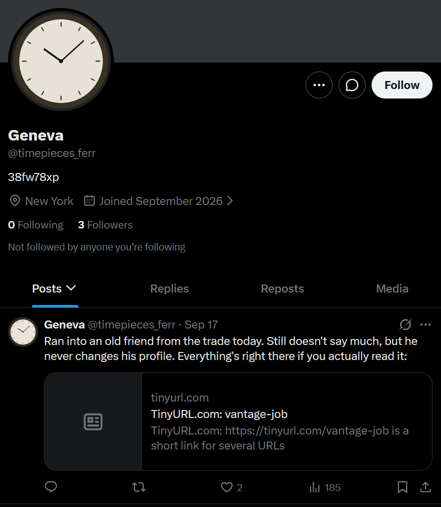
<figcaption
aria-hidden="true">Pastedimage20260919152301.png</figcaption>
</figure>

**"Ran into an old friend from the trade today. Still doesn't say much, but he never changes his profile. Everything's right there if you actually read it: https://tinyurl.com/vantage-job"**

this URL had the exact same name as the CTF challenge, so I knew I was on the right track, but sadly, it just linked back to the original twitter account.

its bio was also interesting **"38fw78xp"**. perhaps this is some sort of encrypted message or password?

This is where my progress hit a wall. all the hints just told me to read carefully, and the posts were super cryptic. I spent HOURS searching the internet for more accounts. I did manage to find a number of accounts with the same name, but they were either dead ends, or strangely, NSFW V-tubers? I spent so long on this, that I had honestly given up. this was my first ever CTF, and it was almost 5am, so i decided to head to bed.

but as I shut my eyes, the answer came to me! what if the strange string in the decryption of the account was not a message, but a URL slug??

I tried many different websites, Telegram, Discord, Pastebin, youtube, but none had a page with that as a slug. until I looked closer at the account, and remembered that it had used https://tinyurl.com for one of its hints! what if the answer is in https://tinyurl.com/38fw78xp?

and it was like music to the eyes, here it was, the breakthrough I needed:
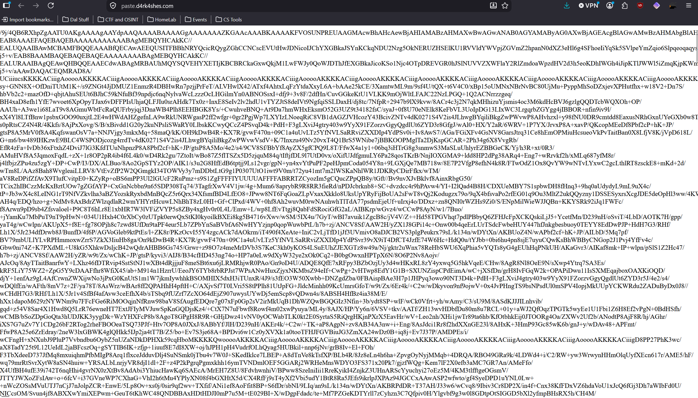

Immediately, I could tell this was some sort of file, So I copied the whole thing, and threw it into CyberChef, and it gave me an image:

<figure>
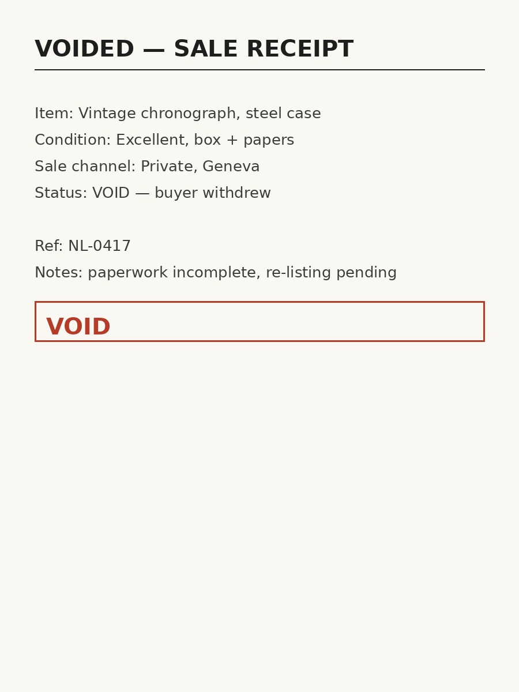
<figcaption aria-hidden="true">download.jpg</figcaption>
</figure>

What's the first thing you do with a strange new image file in a CTF? you check the metadata! so I did and voila! it was finally here:

<figure>
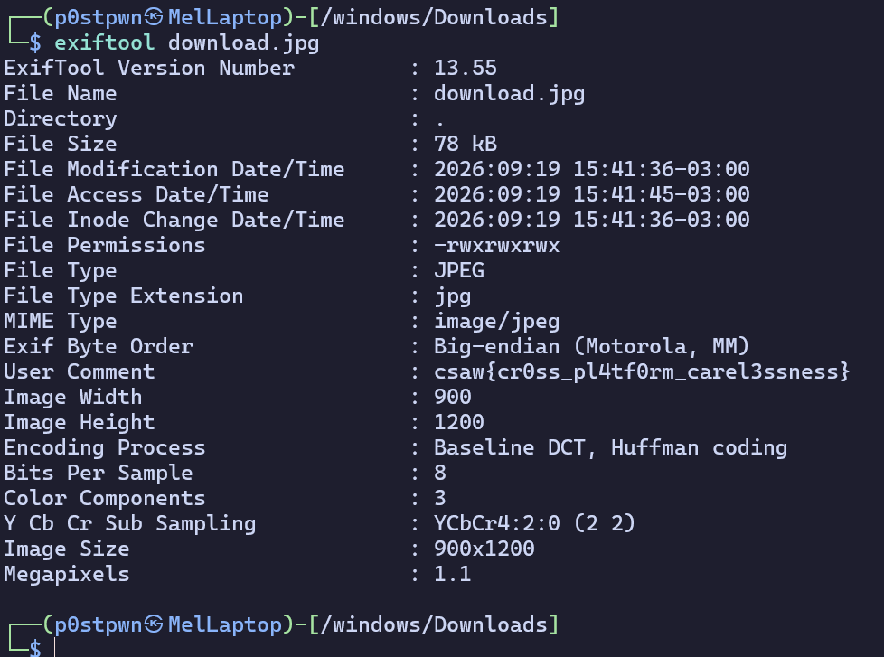
<figcaption
aria-hidden="true">Pastedimage20260919154335.png</figcaption>
</figure>

We got the flag!

`csaw{cr0ss_pl4tf0rm_carel3ssness}`

### Conclusion

So there is how I solved my first ever competitive CTF! let me know how I did with this write up, and ways I can improve! I am excited to further my learning in the field and advance my skills to solve more and more complex CTFs!

Thank you so much for reading!

Stay Free as in Freedom,

- 4nx13ty_p3rs1sts (as part of Status_418)
